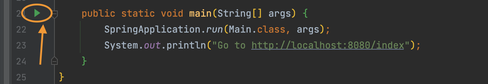
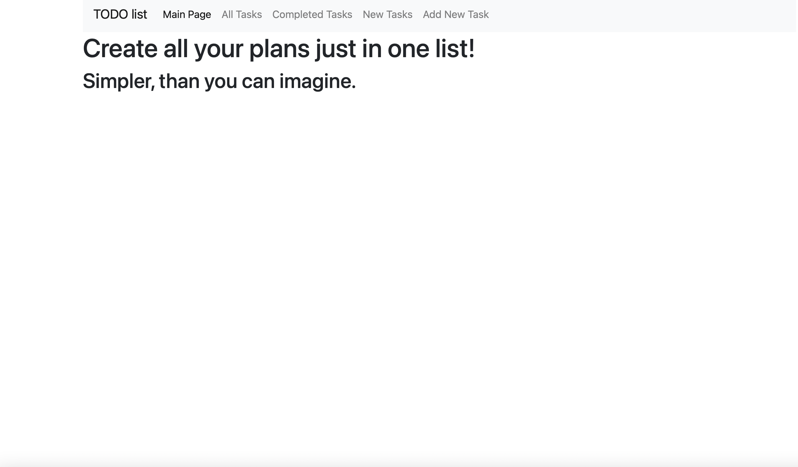
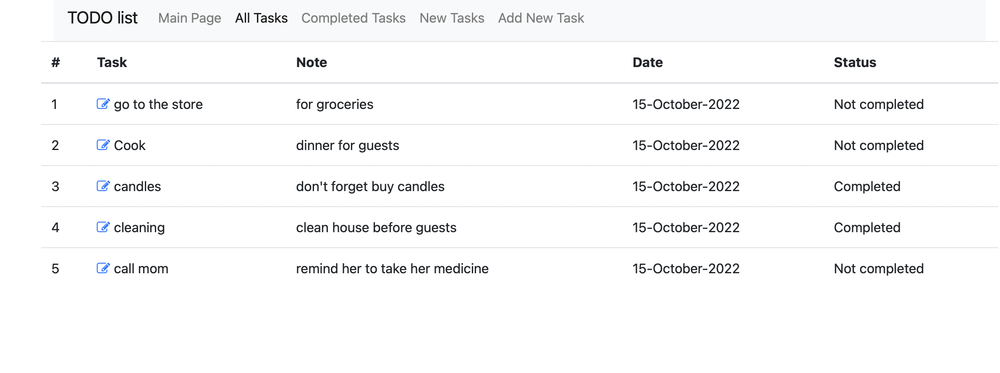
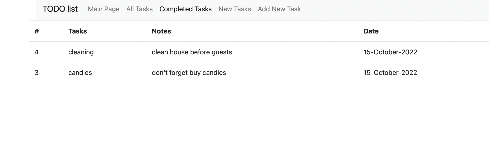
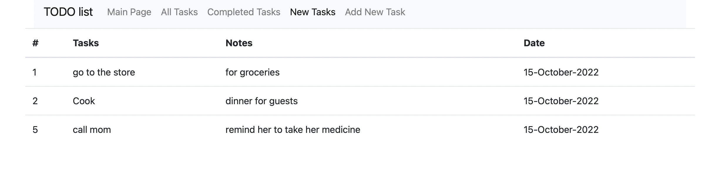
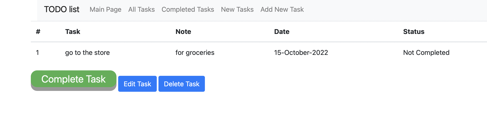
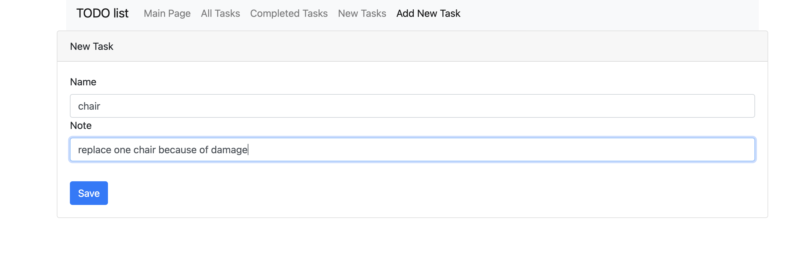
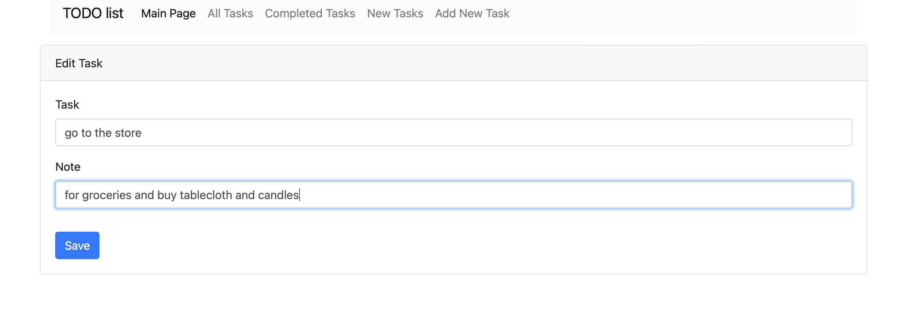
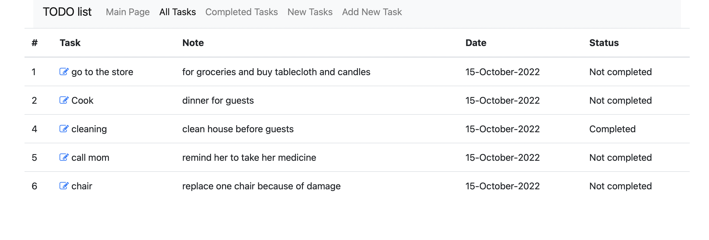

# Technical task - project "TODO list"

[](https://github.com/piyushsuthar/github-readme-quotes)
## Environment before launch

[Intellij IDEA](https://www.jetbrains.com/idea/download/ )

[PostgreSql](https://www.postgresql.org/download/)

[JDK 18](https://www.oracle.com/java/technologies/downloads/#java17)


## Technology stack:

### All these technologies I describe here lay in the [POM](pom.xml) file in this project with necessary versions.


## Application launch process

PostgreSQL with password: **password**
```sql
    create database todolist
```
 ---
#### Create tables in PostgreSQL through LiquiBase: 
```
Maven -> plugins -> liquibase -> liquibase:update
```

 ---
In the root of project through ***Main*** file you can launch the app.



#### Use this app to your heart's content.
   
## Main Page



## Site functionality






